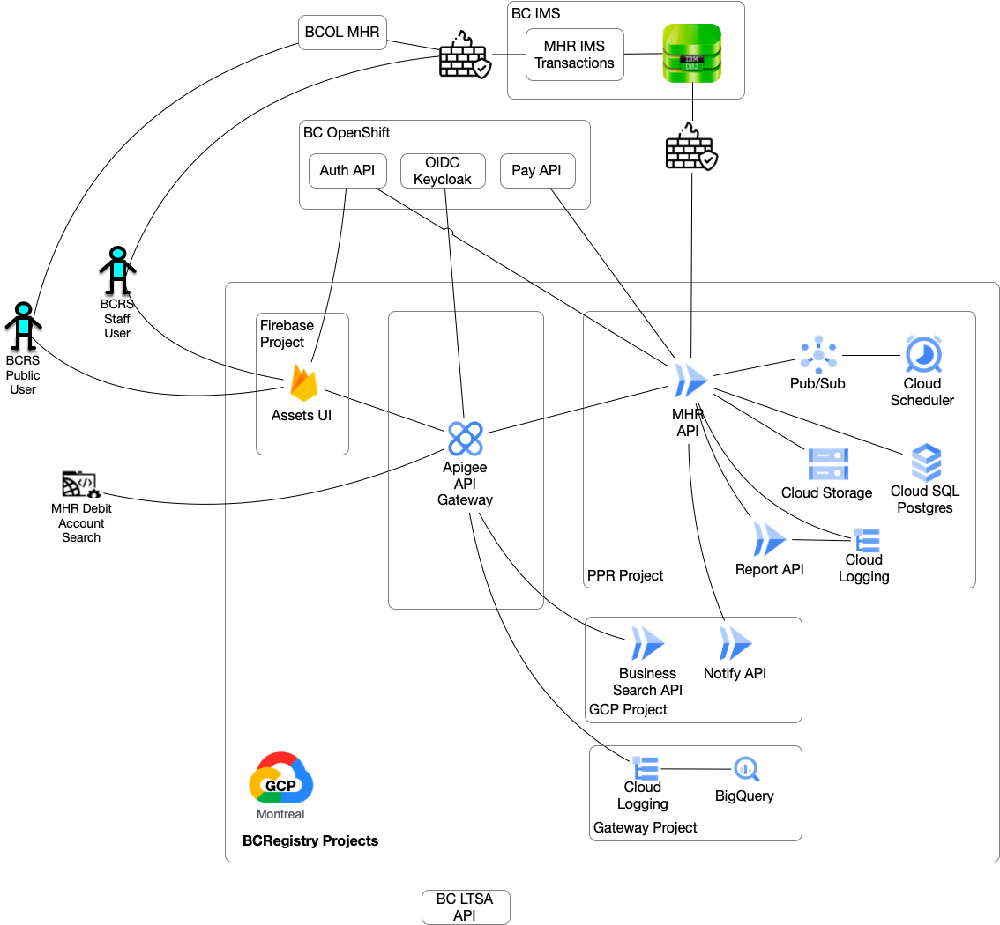
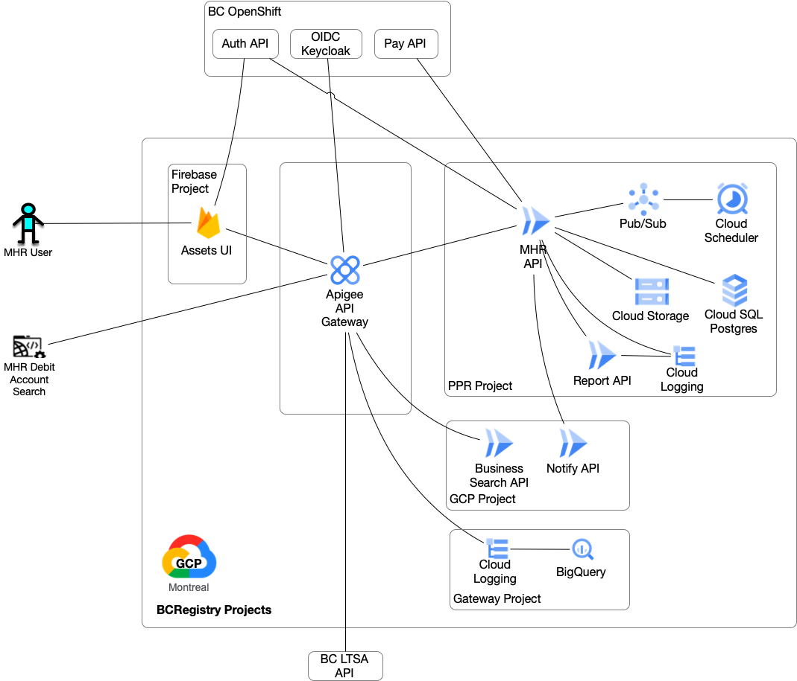

# MHR Data Migration from Legacy DB2 to Modernized PostgreSQL
The data migration has the following steps:
1. Pre-migration tasks.
2. Extract the legacy DB2 MHR tables from PROD and load into PostreSQL PPR database staging tables.
3. Transform the PostreSQL PPR database staging tables legacy data values into the target PostgreSQl values. 
4. Load the PostgreSQL PPR database staging table data into the PostgreSQL PPR database target tables. 

## 1. Pre-Migration Tasks

### a. Create the GCP cloud storage buckets in each environment to hold the extract csv files.
| Environment | Bucket ID |
|-------------|-----------|
| DEV | mhr-db2-bucket |
| TEST | mhr-db2-test |
| SANDBOX | mhr-db2-sandbox |
| PROD | mhr-db2-prod |

### b. Identify the service account

| Environment | Command | Serivce Account |
|-------------|---------|-----------------|
| DEV | gcloud sql instances describe ppr-dev-cloudsql | p818160024412-kbxi5g@gcp-sa-cloud-sql.iam.gserviceaccount.com |
| TEST | gcloud sql instances describe ppr-test-cloudsql | p560587715711-x6rv88@gcp-sa-cloud-sql.iam.gserviceaccount.com |
| SANDBOX | gcloud sql instances describe ppr-sandbox-pbdb | p846149845110-g5rxv7@gcp-sa-cloud-sql.iam.gserviceaccount.com |
| PROD | gcloud sql instances describe ppr-prod | p1060957300107-rpphpu@gcp-sa-cloud-sql.iam.gserviceaccount.com |

### c. Grant cloud storage permissions
Grant the storage.objectAdmin IAM role to the Cloud SQL instance service account for the bucket mhr-db2-{envname}

### d. Run Database Pre-migration Scripts
    Run -2-mhr-staging-create-table.sql
    Run -1-mhr-staging-create-function.sql

## 2. Load Legacy DB2 Extract File Data into PostgreSQL Staging Tables
Use '|' character as the csv file field delimiter.
Disable mhr-api requests in the API Gateway prior to generating the PROD extract.

### a. Generate a PROD extract
Request a PROD extract of the legacy MHR DB2 tables PROD schema AMHRPDB be copied to bcsc01d.gov.bc.ca. 

### b. Copy the extract files to a location on the mainframe accessible by FTP:
The extract file suffix format is .D{YYMMDD} where YY is a 2 digit year, MM is a 2 digit month, and DD is a 2 digit day. For example, "D230209".
Open a VPN connection

    cd {local_dir}/db2_extract/{yyyy-mm-dd}
    ssh pv86737@bcsc01d.gov.bc.ca
    cd /tmp
    cp "//'AMHRP.EXPORT.CONTNUMB.D{YYMMDD}'" AMHRP.EXPORT.CONTNUMB.D{YYMMDD}
    cp "//'AMHRP.EXPORT.CMPSERNO.D{YYMMDD}'" AMHRP.EXPORT.CMPSERNO.D{YYMMDD}
    cp "//'AMHRP.EXPORT.DESCRIPT.D{YYMMDD}'" AMHRP.EXPORT.DESCRIPT.D{YYMMDD}
    cp "//'AMHRP.EXPORT.DOCDES.D{YYMMDD}'" AMHRP.EXPORT.DOCDES.D{YYMMDD}
    cp "//'AMHRP.EXPORT.DOCUMENT.D{YYMMDD}'" AMHRP.EXPORT.DOCUMENT.D{YYMMDD}
    cp "//'AMHRP.EXPORT.LOCATION.D{YYMMDD}'" AMHRP.EXPORT.LOCATION.D{YYMMDD}
    cp "//'AMHRP.EXPORT.MANUFACT.D{YYMMDD}'" AMHRP.EXPORT.MANUFACT.D{YYMMDD}
    cp "//'AMHRP.EXPORT.MANUHOME.D{YYMMDD}'" AMHRP.EXPORT.MANUHOME.D{YYMMDD}
    cp "//'AMHRP.EXPORT.MHOMNOTE.D{YYMMDD}'" AMHRP.EXPORT.MHOMNOTE.D{YYMMDD}
    cp "//'AMHRP.EXPORT.OWNER.D{YYMMDD}'" AMHRP.EXPORT.OWNER.D{YYMMDD}
    cp "//'AMHRP.EXPORT.OWNGROUP.D{YYMMDD}'" AMHRP.EXPORT.OWNGROUP.D{YYMMDD}
    cp "//'AMHRP.EXPORT.WITNESS.D{YYMMDD}'" AMHRP.EXPORT.WITNESS.D{YYMMDD}
    exit

### c. Fetch the extract files
Transfer the files to a local directory named with the extract date. Rename the suffix to ".csv". 

    ftp pv86737@bcsc01d.gov.bc.ca
    cd /tmp
    ascii
    get AMHRP.EXPORT.CONTNUMB.D{YYMMDD} AMHRP.EXPORT.CONTNUMB.csv
    get AMHRP.EXPORT.CMPSERNO.D{YYMMDD} AMHRP.EXPORT.CMPSERNO.csv
    get AMHRP.EXPORT.DESCRIPT.D{YYMMDD} AMHRP.EXPORT.DESCRIPT.csv
    get AMHRP.EXPORT.DOCDES.D{YYMMDD} AMHRP.EXPORT.DOCDES.csv
    get AMHRP.EXPORT.DOCUMENT.D{YYMMDD} AMHRP.EXPORT.DOCUMENT.csv
    get AMHRP.EXPORT.LOCATION.D{YYMMDD} AMHRP.EXPORT.LOCATION.csv
    get AMHRP.EXPORT.MANUFACT.D{YYMMDD} AMHRP.EXPORT.MANUFACT.csv
    get AMHRP.EXPORT.MANUHOME.D{YYMMDD} AMHRP.EXPORT.MANUHOME.csv
    get AMHRP.EXPORT.MHOMNOTE.D{YYMMDD} AMHRP.EXPORT.MHOMNOTE.csv
    get AMHRP.EXPORT.OWNER.D{YYMMDD} AMHRP.EXPORT.OWNER.csv
    get AMHRP.EXPORT.OWNGROUP.D{YYMMDD} AMHRP.EXPORT.OWNGROUP.csv
    get AMHRP.EXPORT.WITNESS.D{YYMMDD} AMHRP.EXPORT.WITNESS.csv
    quit

### d. Perform any csv file minor data cleanup.

### e. Load extract file data into PostgreSQL staging tables
Use gcloud to load csv into PostgreSQL.
Reference load command https://cloud.google.com/sql/docs/postgres/import-export/import-export-csv#gcloud_1
Reference load command format parameters: https://cloud.google.com/sdk/gcloud/reference/sql/import/csv

#### i. From the GCP console, upload the extract files to the environment cloud storage bucket mhr-db2-{envname} 

| Environment | Bucket ID |
|-------------|-----------|
| DEV | mhr-db2-bucket |
| TEST | mhr-db2-test |
| SANDBOX | mhr-db2-sandbox |
| PROD | mhr-db2-prod |

Upload the following files to the target environment GCP bucket:
- AMHRP.EXPORT.DESCRIPT.csv
- AMHRP.EXPORT.LOCATION.csv
- AMHRP.EXPORT.MANUFACT.csv
- AMHRP.EXPORT.MANUHOME.csv
- AMHRP.EXPORT.MHOMNOTE.csv
- AMHRP.EXPORT.OWNER.csv
- AMHRP.EXPORT.OWNGROUP.csv
- Optionally AMHRP.EXPORT.DOCDES.csv for import testing

#### ii. Load the extract file data into the staging tables
Command example

    gcloud sql import csv INSTANCE_NAME gs://BUCKET_NAME/FILE_NAME \
    --database=DATABASE_NAME \
    --table=TABLE_NAME
    --user=USERNAME \
    --quote="7E" \
    --fields-terminated-by="7C"

The ASCII hex code for the '|' character is 7C, '"' is 22, ';' is 3B, and '~' is 7E.

Don't need docdes, only use it for import testing.

    gcloud sql import csv ppr-{sql-envname} gs://mhr-db2-{envname}/AMHRP.EXPORT.DOCDES.csv \
    --database=ppr \
    --table=staging_mhr_doc_types \
    --user=USERNAME \
    --quote="7E" \
    --fields-terminated-by="7C"

    gcloud sql import csv ppr-{sql-envname} gs://mhr-db2-{envname}/AMHRP.EXPORT.MANUFACT.csv \
    --database=ppr \
    --table=staging_mhr_manufacturer \
    --user=USERNAME \
    --quote="7E" \
    --fields-terminated-by="7C"

    gcloud sql import csv ppr-{sql-envname} gs://mhr-db2-{envname}/AMHRP.EXPORT.MANUHOME.csv \
    --database=ppr \
    --table=staging_mhr_manuhome \
    --user=USERNAME \
    --quote="7E" \
    --fields-terminated-by="7C"

    gcloud sql import csv ppr-{sql-envname} gs://mhr-db2-{envname}/AMHRP.EXPORT.OWNGROUP.csv \
    --database=ppr \
    --table=staging_mhr_owngroup \
    --user=USERNAME \
    --quote="7E" \
    --fields-terminated-by="7C"

    gcloud sql import csv ppr-{sql-envname} gs://mhr-db2-{envname}/AMHRP.EXPORT.OWNER.csv \
    --database=ppr \
    --table=staging_mhr_owner \
    --user=USERNAME \
    --quote="7E" \
    --fields-terminated-by="7C"

    gcloud sql import csv ppr-{sql-envname} gs://mhr-db2-{envname}/AMHRP.EXPORT.MHOMNOTE.csv \
    --database=ppr \
    --table=staging_mhr_note \
    --user=USERNAME \
    --quote="7E" \
    --fields-terminated-by="7C"

    gcloud sql import csv ppr-{sql-envname} gs://mhr-db2-{envname}/AMHRP.EXPORT.LOCATION.csv \
    --database=ppr \
    --table=staging_mhr_location \
    --user=USERNAME \
    --quote="7E" \
    --fields-terminated-by="7C"
    
    gcloud sql import csv ppr-{sql-envname} gs://mhr-db2-{envname}/AMHRP.EXPORT.DESCRIPT.csv \
    --database=ppr \
    --table=staging_mhr_description \
    --user=USERNAME \
    --quote="7E" \
    --fields-terminated-by="7C"

    gcloud sql import csv ppr-{sql-envname} gs://mhr-db2-{envname}/AMHRP.EXPORT.DOCUMENT.csv \
    --database=ppr \
    --table=staging_mhr_document \
    --user=USERNAME \
    --quote="7E" \
    --fields-terminated-by="7C"

Check the import status:

Command Example:

    gcloud sql operations list \
    --instance INSTANCE_NAME \
    --limit 10
    
    gcloud sql operations list --instance ppr-dev-{sql-envname} --limit 10

## 3. Transform the MHR Staging Table Data
Run the database SQL scripts in the following order.
1.  1-mhr-staging-trim.sql
1.  2-mhr-staging-alter-table.sql
1.  3-mhr-staging-code-type.sql
1.  4-mhr-staging-timestsamp.sql
1.  5-mhr-staging-name.sql
1.  6-mhr-staging-address.sql
1.  7-mhr-staging-draft.sql
1.  8-mhr-final-pkey.sql
  
Data conversion/transformation issues are tracked here:
https://docs.google.com/spreadsheets/d/1OJRbcynL9CNC6e7ahNh4UyLb5NykJkBl/edit#gid=1125294405

## 4. Load the MHR Staging Table Data
Load the staging_mhr_* table data into the mhr_* tables.
Run the database SQL scripts in the following order.
1.  9-mhr-backup.sql
1.  10-mhr-final-load.sql

Migration Script Timings (Approximate):

| Description | Duration (minutes) |
|--------------|-----------------|
| Extract files fetch | 10 |
| Extract files cleanup and upload | 10 |
| CSV to staging tables load | 10 |
| Staging tables data transformation | 25 |
| Staging tables to final tables load | 15 |

